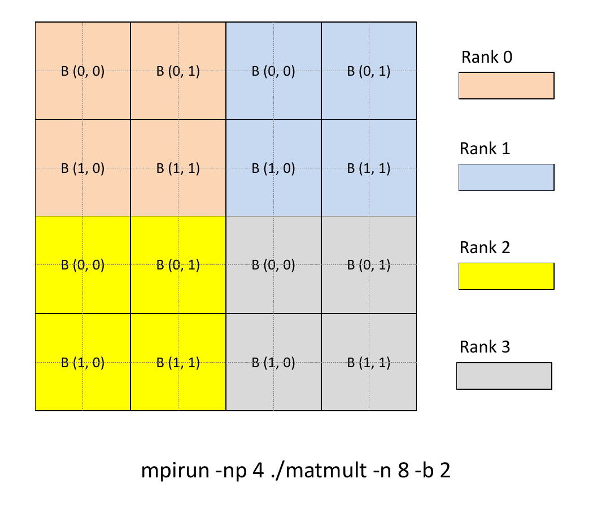
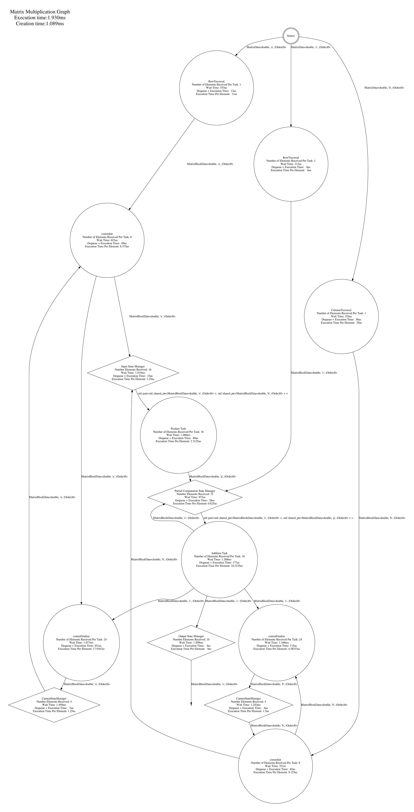

## Tutorial 7 - Under development. 

This is a basic working version. Check To Do list.

Using hedgehog to run double-precision distributed "streaming" matrix multiplication (dgemm) using [Cannon's algorithm](https://en.wikipedia.org/wiki/Cannon%27s_algorithm).

Tutorial 3 is modified and two more hedgehog tasks are added for each matrix to carry out MPI communication. Each task runs using one thread. Additional dependencies and the state manager are created to execute the main loop in Cannon's algorithm.

Compile: Update hedgehog path in the file "compile.sh" and run it. Tested with g++\-8 and MPICH 3.2.

Run: mpirun -np 4 ./matmult -n 8 -b 2 -v 1

For simplicity num of ranks must be a perfect square, and matrix size should be divisible by sqrt(num of ranks). Matrix is assumed to be a square matrix. e.g., running the above mpirun configuration will spawn 4 ranks with the matrix size of 8x8. Each rank will get a patch of 4x4. Each rank then will divide the its patch into the tsmaller blocks of 2x2 i.e., 4 blocks per rank and the multiplication is carried out as a "streaming" of blocks. The option "-v 1" will verify the output. 

The following graph shows the taskgraph for rank 0. Compare it with the taskgraph of tutorial 3. Additional tasks InitComm, FinalizeComm and CommState are created to handle  communication. Notice the loop after Comm state which carries out iterations of the Cannon's algorithm.

### To DO:
- Counts of blocks and "q" passed to tasks are tricky to figure out. Add comments in the code before the logic evaporates from the mind - done
- Reorganize comm tasks
- Test with FP numbers.
- Verify multiple threads for product and addition task - done
- Currently assuming the square matrices, and square blocks. So using nblocks in many places. Fix it to correct mblocks / pblocks
- See if moving finalize comm task after product task works fine. If yes, comm and addition can be overlapped
- See if the two for loops in the finalize comm task can be merged. Will give better streaming
- See if MPI_Testall can be called for the previous blocks for every new block pushed into the finalize comm task. Will help comm progress
- Add timing code
- Test performance, figure out ideal thread configuration
- Find out a way to call destroyComm. Currently it is not destroyed causing a memory leak
- Add changes between Tutorial 3 and 7
- Currently assuming the square matrices, and square blocks. Fix for uneven, non square sizes

Caution: Getting rid of race conditions / hangs / deadlocks coupled with comm is very tricky. Take baby steps.

